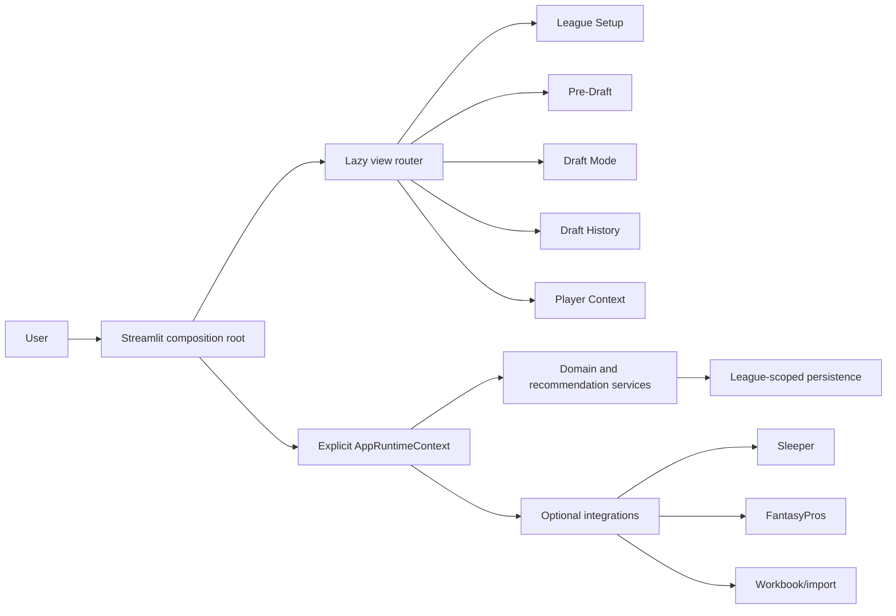
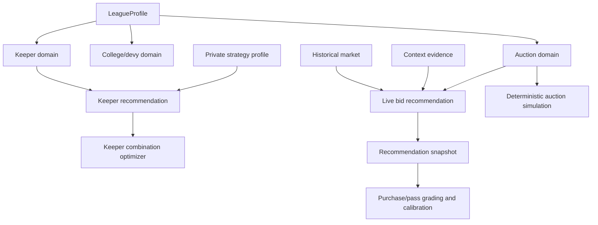

# Architecture

The Auction Copilot is a Python 3.9 Streamlit application organized around typed domain services. `app.py` composes the active league runtime and routes to one lazily imported view; view modules render results but do not own auction or keeper math.

## Runtime boundaries

- `src/app_runtime.py` declares per-view requirements and constructs only the services required by the selected view.
- `src/views/router.py` imports only the active renderer. This keeps League Setup and history views from initializing draft intelligence integrations.
- `src/runtime_identity.py`, `src/auth_identity.py`, and `src/private_state.py` separate league identity, user identity, and manager identity. Private records require the full league+user+manager scope.
- `src/league_profile.py` represents normalized multi-league rules. Bishop defaults are data, not branching logic.
- `src/league_setup_data.py` merges values using explicit manual input, import/workbook, Sleeper inference, then defaults.

## Domain/service map

Numeric decisions are deterministic and testable. Optional external context can adjust a bounded valuation input, while recommendation caps, legality, reserve enforcement, keeper selection, and simulations remain service-owned calculations.

## Persistence boundary

Local operation stores runtime state below `FANTASYFOOTBALL_DATA_DIR`. Hosted operation can mirror authoritative setup, draft ledgers, recommendation snapshots, league profiles, and private preferences to an authenticated state object. ETag conditional writes reject stale writers. Rebuildable player-context caches are not part of the durable archive.

See [Data and RAG](DATA_AND_RAG.md), [Decision Engines](DECISION_ENGINES.md), and [Reliability and Deployment](RELIABILITY_AND_DEPLOYMENT.md).
