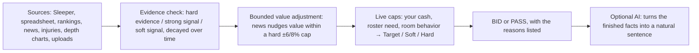

# Business overview

## What this is

The Fantasy Football Draft Copilot is a **live decision cockpit for a dynasty
auction draft**. When a player is nominated, the manager has seconds to decide
whether to bid, how high, and why — with real money at stake and eleven
opponents in the room. The app turns rosters, budgets, rankings, news, and
injury/depth-chart signals from every league the manager is in into a
**bid / pass call with a defensible number**, fast enough to use under the
bidding clock.

It also covers everything around that moment: pre-draft keeper decisions,
opponent scouting, nomination strategy, and a post-draft review where the app
grades its own advice.

## Who it's for

- **The primary user** is a manager in one or more dynasty leagues — auction or
  snake — who wants a faster, more disciplined, more explainable version of the
  spreadsheet-and-gut process they run today.
- **Leagues on Sleeper** connect directly for live roster and sale sync.
- **Leagues off-platform** (Yahoo, home leagues) run entirely on manual entry
  plus an optional spreadsheet import — no platform integration required.
- **A non-technical reader** can open **💡 How This Works** in the app for a
  plain-language walkthrough with a worked example, in a few minutes.

## The core promise

| Promise | What it means | How it's guaranteed |
|---|---|---|
| **Defensible numbers** | Every value, cap, and grade can be traced to the inputs that produced it — no black box. | Deterministic Python; each result carries an `explanation` and reason codes. See [Deterministic math](DETERMINISTIC_MATH.md). |
| **Reproducible** | The same inputs always produce the same recommendation. | No randomness in the decision path; simulations use fixed seeds. |
| **Works without the internet being perfect** | A FantasyPros outage, a Sleeper hiccup, or no AI key degrades enrichment — it never stops a draft. | Optional integrations are enrichment only; stale-cache fallbacks; deterministic core has no external dependency. See [Reliability and deployment](RELIABILITY_AND_DEPLOYMENT.md). |
| **AI can't break the math** | The optional AI layer rephrases finished decisions; it cannot invent or change a number. | Structural boundary enforced in code and tests. See [AI integration](AI_INTEGRATION.md). |
| **Private by identity** | Your strategy and recommendation history are isolated per league and per manager. | State keyed by `league + user + manager`; unmapped visitors fail closed. |
| **No league is special** | Rules are data, not code branches — any league's budgets, keepers, scoring, and roster shape are supported. | Normalized `LeagueProfile`; no hard-coded league logic. |

## What the manager gets, by moment

### Before the draft — League Setup & Pre-Draft

- Import a league workbook (CSV/XLSX) and let the app **auto-fill** teams,
  budgets, keepers, devy rights, and price history — prompting only for what it
  genuinely can't detect. A workbook is never required.
- Per-team economics: entering cash, keeper commitments, live cash,
  minimum-bid reserve, discretionary cash, traded dollars, and where each
  number came from (provenance).
- **Typed keeper recommendations** — current and future value, age adjustment,
  cost, auction value, surplus, scarcity, roster fit, a strategy score, and a
  KEEP / BORDERLINE / PASS call with reasons.
- **Exhaustive best-4 / best-5 / best-6 keeper comparison** — spend, remaining
  cash and roster spots, current/future value, surplus, and the opportunity
  cost of the keepers you leave behind. Keeping fewer never creates bonus
  money; it creates an auction roster spot.
- **Keeper economics** over a 2–3 year horizon: projected cost escalation,
  annual and cumulative surplus, break-even year, and keeper runway.
- **College/devy** promote-now vs. leave-on-taxi guidance, kept strictly
  separate from the regular auction pool.
- A **Win Now / Hybrid / Win Later** strategy slider that re-weights every
  future-vs-present trade-off.

### During the draft — Draft Mode

- For the nominated player: **Target Value, Soft Cap, Hard Cap**, recomputed as
  the bid moves, and a zone read (VALUE / TARGET / SOFT CAP / HARD CAP / PASS).
- Caps that rise or fall with roster need, tier scarcity, available
  alternatives, cash, auction stage, live room inflation, and evidence-weighted
  news — each contribution shown, total swing bounded.
- **PASS output names the fallback**: the next-best player, a rough price range,
  an availability read, and a regret-risk score.
- **Nomination strategy**: Drain Cash, Acquire Target, Create Chaos, Hide Need,
  Attack Manager.
- **Opponent scouting**: per-opponent threat on the current player, manager
  tendencies (aggression, position premiums, star-chasing, timing), and
  "run-hot" warnings when cash-rich teams converge on a thin tier.
- Live sync from Sleeper for completed sales, or manual nomination/sale entry
  for any league. Sleeper is authoritative for completed Sleeper sales; manual
  leagues use a local sale ledger.
- Snake leagues get the parallel treatment: a VORP + roster-need draft board
  and a projected full remaining-roster plan.

### After the draft — Manager Intelligence & Draft History

- The copilot **grades its own advice**: every purchase (price discipline,
  roster fit, alternative cost, downstream outcome) and every pass (was the
  player a value you missed, did a fallback actually materialize), on an A–F
  scale.
- Historical replay against completed auctions and **year-over-year
  calibration** that learns market inflation, positional scarcity, manager
  aggressiveness, and source bias — feeding better estimates next season
  without rewriting recorded history.

### Any time — Player Context

- Search any NFL player against the Sleeper universe with available FantasyPros
  rankings, projections, news, and injury context, plus anything the manager
  has uploaded.

## How information becomes a recommendation

Every step except the last is deterministic arithmetic. The AI step is optional,
off by default, and cannot change anything upstream of it.

## Data sources and precedence

Setup values follow one consistent order, and every field keeps its provenance:

1. **Explicit manual entry** (what the manager typed)
2. **Imported file / league workbook**
3. **Sleeper inference**
4. **Application defaults**

Sleeper is authoritative for completed live auction sales in Sleeper-backed
leagues. Optional source failures never replace or corrupt saved draft state.

## Boundaries and limitations

- The app **does not predict exact opponent bids** — it models threat and
  pressure, not a number.
- It **does not run the college draft** — devy rights are tracked, the draft
  itself is elsewhere.
- **Yahoo roster/auction APIs are not integrated** — Yahoo leagues use import +
  manual entry.
- It **maps** authenticated identities (Posit Connect) to managers but does not
  implement its own sign-in, user administration, or invitations.
- External data quality depends on the configured provider; a provider problem
  degrades enrichment, it doesn't prevent startup.
- The hosted durable store is a single-object ETag-guarded design, not a
  horizontally scalable transactional database.

## Where to go next

- [Architecture](ARCHITECTURE.md) — how the system is put together.
- [Data and RAG](DATA_AND_RAG.md) — source reconciliation, provenance, and the
  local retrieval pipeline.
- [Decision engines](DECISION_ENGINES.md) — the engines in narrative form.
- [Deterministic math](DETERMINISTIC_MATH.md) — every formula.
- [AI integration](AI_INTEGRATION.md) — the generative layer and its limits.
- [Reliability and deployment](RELIABILITY_AND_DEPLOYMENT.md) — idempotent sync,
  recovery, hosting.
- [Portfolio demo](../demo/README.md) — a runnable synthetic league.
