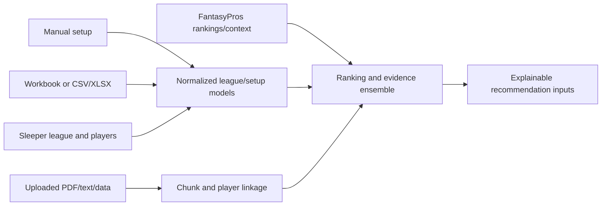

# Data, provenance, and retrieval

## Source precedence

League setup fields retain provenance and follow one consistent order:

1. explicit manual entry;
2. imported file or optional workbook;
3. Sleeper inference;
4. league defaults.

Sleeper remains authoritative for completed sales in a connected live auction. A Yahoo/manual league uses the same player universe and recommendation services, but its keeper ownership, budgets, nominations, and sales are entered or imported by the user.

## Player universe and rankings

- Sleeper supplies the global NFL player universe even for manual leagues; the last successful cache supports temporary provider outages.
- Spreadsheet rankings and FantasyPros data are optional. Missing sources degrade the ensemble and show health/freshness information rather than blocking startup.
- Ranking disagreement is exposed as information and is not automatically treated as risk.
- League scoring settings feed scoring-adjusted projections where source data permits.
- College/devy rights are modeled separately and are strictly excluded from the regular auction player pool.

## Local retrieval pipeline

`src/file_drop_rag.py` accepts PDF, text, Markdown, CSV, TSV, and JSON research. It extracts text, creates overlapping chunks, generates deterministic local hash embeddings, links exact normalized player entities, and converts recognized claims into player-context documents. No external embedding service is required.

Evidence is labeled as hard evidence, strong analytical signal, or soft signal. Context interpretation applies recency decay, confidence, source identity, and state supersession so an old injury report does not indefinitely outweigh a newer resolution. Every adjustment retains its document and reason provenance.

## Data safety

- Optional source failures cannot replace saved draft state.
- Private strategy and recommendation history are keyed by league+user+manager.
- API keys and authenticated-user mappings come from environment variables and are never serialized into league data.
- Uploaded research may contain private league information and should be handled as private application data.
- Uploaded research feeds the **deterministic** context pipeline, not the LLM. See [AI integration](AI_INTEGRATION.md) for the generative boundary and [Deterministic math](DETERMINISTIC_MATH.md) §5–6 for evidence weighting, recency decay, and the bounded valuation adjustment.
