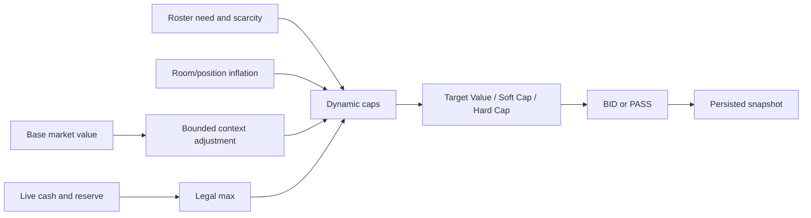

# Recommendation, keeper, and simulation engines

## Keeper decisions

Keeper inputs are typed models covering current value, two-to-three-year future value, age adjustment, keeper cost, comparable auction value, surplus, scarcity, roster fit, and the user's Win Now/Hybrid/Win Later weights. The recommendation service returns a deterministic strategy score, explanation, and reason codes.

The legal combination optimizer enumerates valid four-, five-, and six-keeper sets (bounded by league rules), then compares:

- keeper spend and remaining cash;
- remaining auction roster spots and minimum-bid reserve;
- current and future value;
- surplus and opportunity cost.

Keeper economics project configurable annual cost escalation, pickup-price transition, annual/cumulative surplus, break-even year, and runway. Unused keeper slots create auction roster spots, never bonus cash.

College/developmental recommendations are a separate engine. They account for eligibility, role, draft capital, production, future value, age, depth chart, roster need, promotion economics, taxi opportunity cost, and capacity, returning `PROMOTE NOW`, `LEAVE ON TAXI`, `BORDERLINE`, or `NOT ELIGIBLE` with reason codes.

## Live auction decisions

The live recommendation never predicts an exact opponent bid. It gives a target value, soft cap, and hard cap based on live cash, minimum reserve, alternatives, scarcity, roster fit, auction stage, explainable context, and observed room inflation. PASS output identifies fallback options, availability probability, and regret risk.

Nomination recommendations support Drain Cash, Acquire Target, Create Chaos, Hide Need, and Attack Manager. Manager models summarize tendencies and run-hot conditions without asserting precise future bids.

## Simulation and learning

The scalable simulator uses seeded random generators and typed strategy inputs to compare opening strategies, position budgets, target tiers, fallback chains, auction action plans, and ideal-roster blueprints. Fixed seeds make test and replay outcomes reproducible.

Meaningful live recommendations are stored with roster, budget, inflation, context, alternatives, and identity scope. Completed decisions can be graded as purchases or passes, replayed against historical auctions, and summarized for year-over-year calibration. Learning changes explicit calibration inputs; it does not silently mutate recorded history.

## Deterministic and generative responsibilities

All scores, caps, legal checks, optimizations, and simulations are deterministic code. A generative explanation layer may summarize those already-computed inputs when configured, but it is never permitted to invent or alter the numeric recommendation. The deterministic explanation remains the fallback and source of truth.

The exact formulas, constants, and thresholds behind every engine above are catalogued in [Deterministic math](DETERMINISTIC_MATH.md). The generative layer — its four services, guardrails, failure behavior, and data egress — is documented in [AI integration](AI_INTEGRATION.md).
