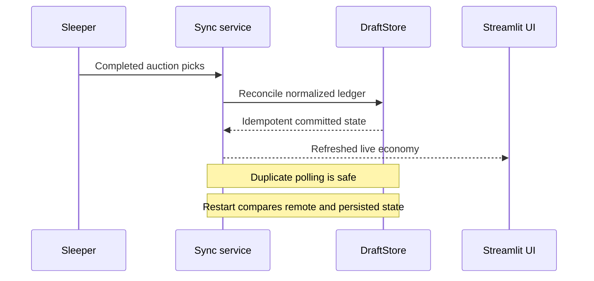

# Reliability and deployment

## Live-state reliability



- Sleeper sync is idempotent and completed sales are authoritative.
- Manual leagues use an ordered local sale ledger with duplicate and sequence validation.
- Recovery reconciles persisted state after restart rather than replaying blind writes.
- Recommendation snapshots are fingerprinted so equivalent reruns do not create duplicate history.
- A full deterministic rehearsal covers reconnect failures, multiple process restarts, reconciliation, replay, and end-state invariants.

## Optional integration failure policy

Workbook, FantasyPros, and uploaded context are enrichment. Their failure may reduce confidence or freshness, but must not corrupt draft state or prevent workbook-free operation. Provider health is visible and refreshes are explicit. Sleeper player data has a stale-cache fallback; live completed-sale authority is not silently transferred to another source.

## Posit Connect deployment

The deployment targets Python 3.9 and keeps `requirements.txt` beside `app.py`. Runtime settings and secrets are environment variables because Connect Cloud does not support Streamlit `st.secrets`.

Connect Cloud runtime files are ephemeral across content restarts. Production therefore requires `FANTASYFOOTBALL_STATE_URL`, an authenticated object endpoint for a ZIP archive of authoritative state. Startup restores the archive before stores are constructed; successful mutations checkpoint it. ETag/`If-Match` handling rejects stale multi-process writes. See [DEPLOYMENT.md](../DEPLOYMENT.md) for the endpoint contract and preflight command.

Authenticated deployments map the stable Posit user subject to a manager through an explicit per-league mapping. An authenticated but unmapped visitor fails closed. Local development preserves the configured single-user fallback.

## Operational checks

```bash
python -m src.deployment
python -m compileall app.py src
pytest
```

The health check verifies the Python version, dependency manifest, writable runtime directory, optional FantasyPros configuration, and required durable storage on Connect Cloud without printing secrets.
