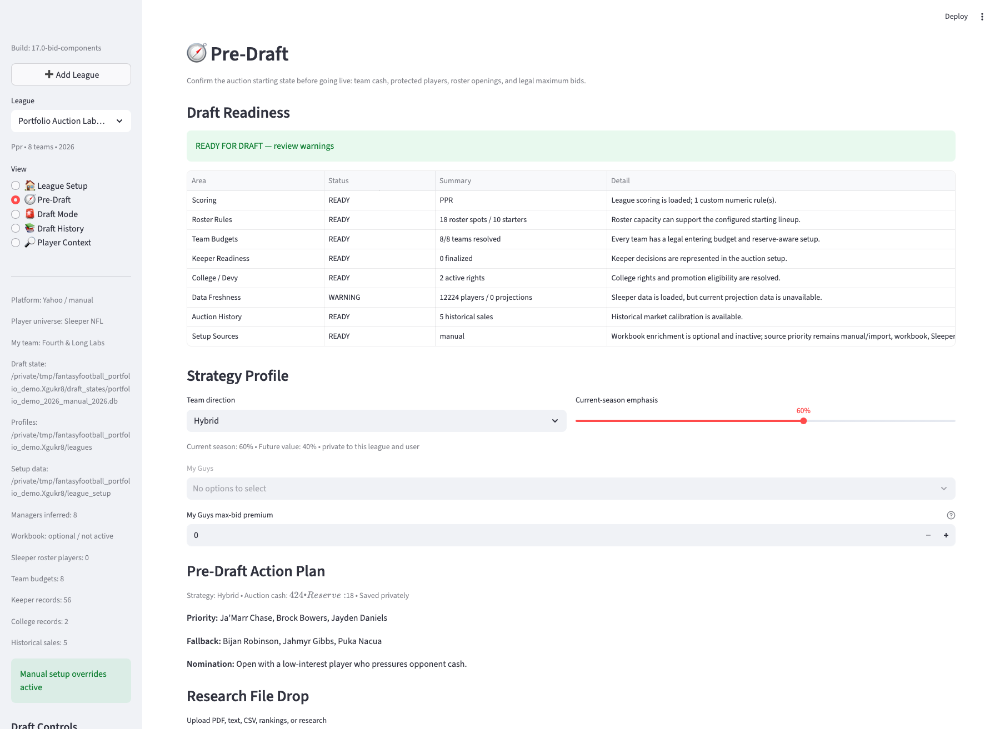
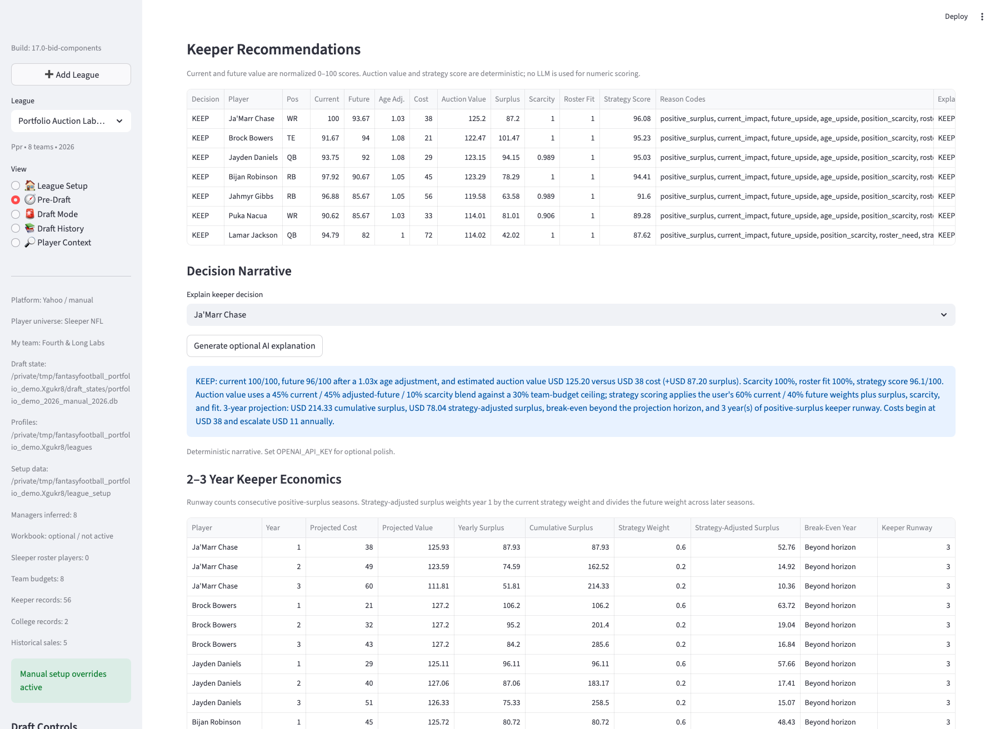
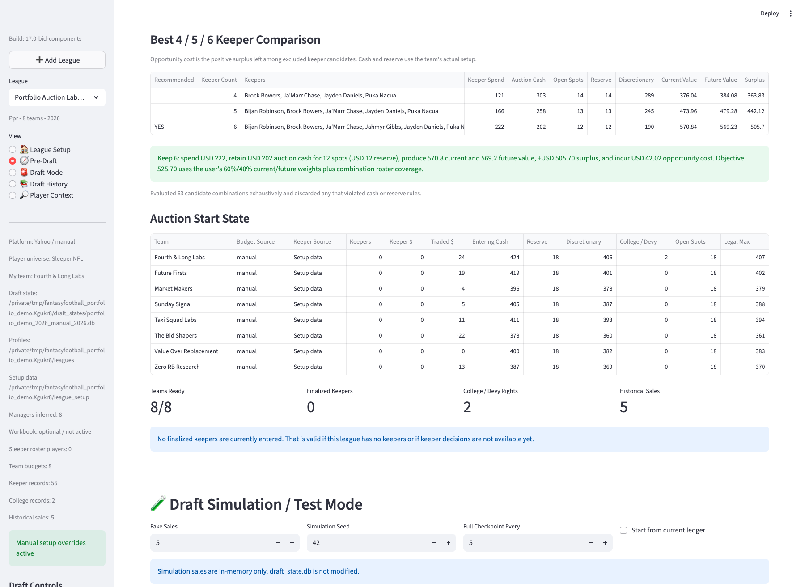
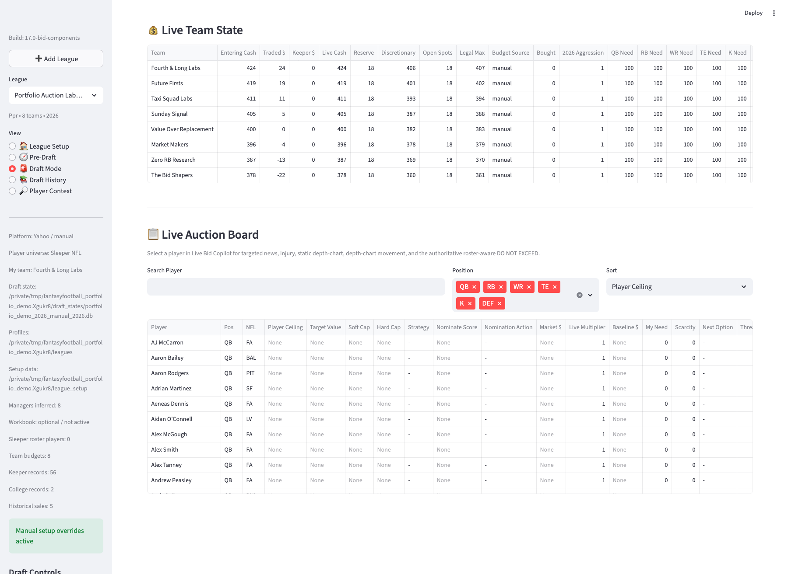

# Portfolio demo screenshots

These screenshots are captured from the runnable synthetic Portfolio Auction Lab fixture, not from a design mockup.

## Pre-Draft readiness and strategy



## Keeper scoring, explanation, and economics



## Legal keeper combinations



## Live auction economy and board



## Regenerate

Install the fixture and start Streamlit and Chrome with remote debugging:

```bash
python -m src.portfolio_demo --data-root /tmp/fantasyfootball-demo
FANTASYFOOTBALL_DATA_DIR=/tmp/fantasyfootball-demo FANTASYFOOTBALL_DEMO_MODE=1 streamlit run app.py --server.port 8765
```

Open Chrome at `http://127.0.0.1:8765` with a local debugging port, then use the repository capture helper:

```bash
python scripts/capture_streamlit.py docs/assets/portfolio-pre-draft.png --port 9223
python scripts/capture_streamlit.py docs/assets/portfolio-keeper-comparison.png --port 9223 --scroll-text "Keeper Recommendations"
python scripts/capture_streamlit.py docs/assets/portfolio-keeper-combinations.png --port 9223 --scroll-text "Best 4 / 5 / 6 Keeper Comparison"
python scripts/capture_streamlit.py docs/assets/portfolio-draft-mode.png --port 9223 --click-text "Draft Mode" --wait 5
```

The helper uses only the local Chrome DevTools protocol and Python's standard library. It does not send league data to a screenshot service.
